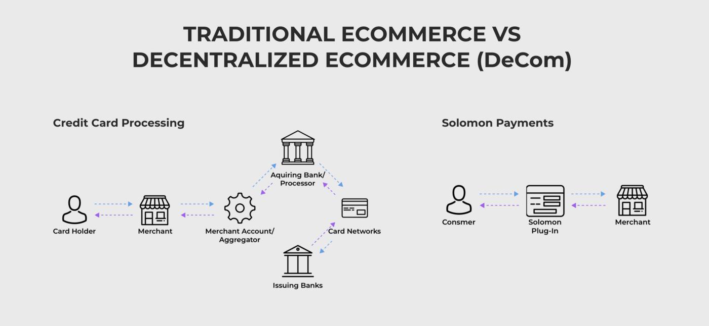
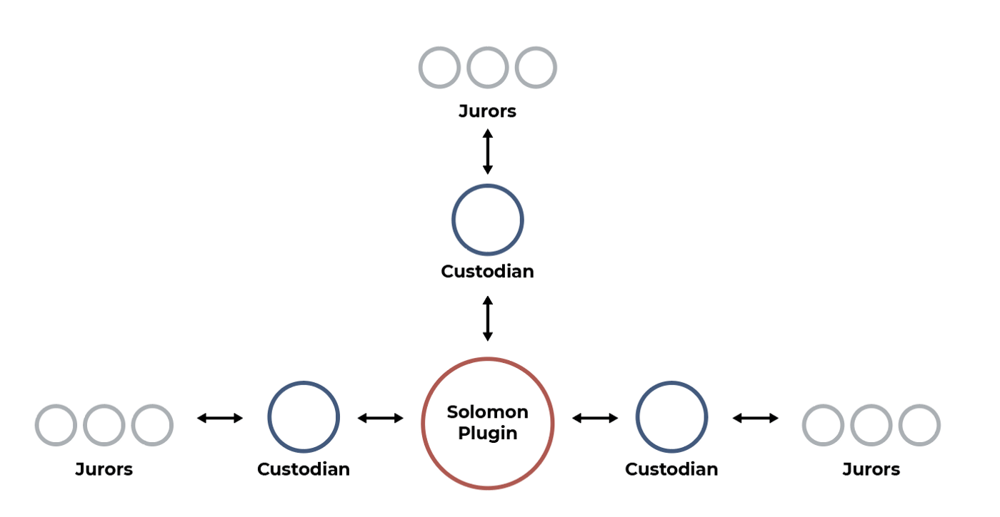

# Why Solomon

The mission of the Solomon Project is to bring about the mainstream adoption of online cryptocurrency payments.

Solomon will achieve this by offering traditional ecommerce protections while preserving the benefits of decentralization. Our plugin
will allow any merchant to easily accept cryptocurrency and inspire consumer confidence with chargebacks, preorders, and escrow.

We call this model “decentralized ecommerce”, or DeCom for short. By combining the virtues of decentralized finance with the protections
demanded by consumers, Solomon will finally bring cryptocurrency payments into the mainstream.

## Problems for Consumers

It is telling that the biggest problem with cryptocurrency in regards to ecommerce is the fact that nearly everyone has heard of it yet
hardly anyone *uses* it.

The advantages of cryptocurrency over credit cards are known and many: accessibility, low fees, fast transactions, unparalleled security,
globalization, and more.

The only disadvantage appears when transactions happen in the real world, such as in the delivery of goods and services. If a buyer sends
cryptocurrency to buy a product online, it is impossible today to reverse the charge if what they receive is not what was promised.

## Problems for Sellers

If this problem of consumer confidence can be solved, sellers will be eager to move away from the credit card-driven system.

In short, the current financial system is overly exclusive and centralized. Profit-driven institutions enforce onerous and often arbitrary
rules, hurting smaller sellers.

Sellers are at the mercy of these institutions, otherwise they are unable to accept payments and earn a living. In the best case scenario,
sellers put up with high fees, slow payment terms, demanding cash deposits, and chargeback penalties. Worst case, they are excluded from
banks and cannot open an account at all, or they are dropped without warning due to rules that favor larger sellers.

There are many reasons why sellers are currently excluded that have nothing to do with the value they offer consumers.

Independent sellers, especially immigrants, may not have a long credit history or the correct paperwork for traditional bank accounts. They
may be unable to afford the high “Reserve Account” deposits that banks require for new sellers, anywhere from 10–20% of monthly revenue.
They may get throttled by monthly payment processing maximums during times when banks should be supporting their growth. Or the bank may
simply not understand or like their products and cut the relationship.

Even if a seller can maintain a relationship with a bank and merchant gateway, they can fall victim to fraudulent chargebacks and associated high fees.
Credit card companies almost never side with sellers for chargebacks, no matter the evidence. Instead, they are incentivized to keep their
cardholders happy because cardholders can easily switch cards, while sellers are desperate to stay on the network and accept payments. Not
only do sellers lose out on vital revenue, banks will tack on extremely high processing fees on top.

In addition, sellers can rarely, if ever, find credit card processors willing to support self-hosted preorder campaigns. Instead, they must
turn to additional third parties who charge a high percentage of revenue on top of credit card fees. Thus, small-scale sellers have limited
options to raise early cash flow, which is when they need it the absolute most.

In today’s pandemic-ravaged world, it has never been more important to give smaller entrepreneurs a chance to earn their livelihoods online.
Hosting and helping only large-scale sellers, such as Amazon, will hurt all consumers in the long run.

## Solution

The Solomon Plugin is an easy-to-use software tool that allows entrepreneurs to accept cryptocurrency payments for their businesses. Any
business can implement the plugin on their sites with only a few lines of code, and consumers and merchants will be protected equally and
fairly.

Immediately they will be able to accept payments from around the world and at significantly lower cost than the traditional 3–5% taken by
credit card processors. The fee is further reduced if paid by the merchant in a native token called the Solomon token (SLM). Users locked
out of traditional access to major ecommerce platforms can now easily incorporate payment processing on their websites without difficulty.

In addition, Solomon introduces completely new features inspired by the Decentralized Finance (DeFi) movement, and is the pioneering project
behind the new concept of Decentralized Ecommerce (DeCom).

Decentralized ecommerce will democratize access and ownership of online commerce while simultaneously improving security and trust.
Fraudulent chargebacks will be eliminated by smart contracts that provide the benefits of traditional escrow but without the traditional
costs and exclusiveness. Escrow smart contracts also enable trustworthy crowdfunding and preorder features because funds can be released on
a schedule, and only if goods are delivered as promised.

Traditional dispute resolution usually entails high costs, bad outcomes, and unfair incentives, with credit card companies protecting their
cardholders and escrow agents protecting their profit margins. Instead, Solomon incentivizes a community of decentralized jurors with
Solomon (SLM) token to handle any disputes if they arise.

### Solomon Jurors

If chargeback or delivery disputes arise, specially elected Solomon jurors will be selected at random on the blockchain to arbitrate and
earn SLM tokens for their work. This creates a lucrative and decentralized gig economy for users. And because these jurors are both
specially elected and paid in SLM that are locked for 4 months, they are incentivized to believe in the platform and produce good work. Only
then will their tokens maintain or grow their value over time.

### Solomon Stakers

The Solomon Project is owned by a decentralized community of SLM holders who stake their tokens to long term non-trading. In return for
demonstrating long term alignment akin to traditional owners, stakers receive the fees generated by the Solomon Plugin each month minus any
payments made to jurors.

Due to their demonstrated financial investment, stakers will be trusted to elect new jurors to the system. Stakers are incentivized to elect
only high-quality, trusted jurors in order to protect their investment, and to elect as many qualified individuals as possible to make the
system robust and stable.

## Summary

Solomon ushers in a new era of decentralized commerce (DeCom) that will solve the remaining issues with accessibility and security in traditional ecommerce. The native Solomon token (SLM) ensures that ownership is decentralized and incentivizes a gig economy that maintains the quality of the system.
While at first glance this appears to taint blockchain with human intervention, the reality is that trade has and always will require cooperation between human parties. The difference is that Solomon does not rely on “good faith” or bloated, centralized institutions motivated by profits over fairness.
Instead, Solomon replaces the same features with a decentralized and efficient system where all stakeholders are personally invested in fairness and long-term success. The result will be fairness, accessibility, and the long-awaited adoption of cryptocurrency payments around the world.